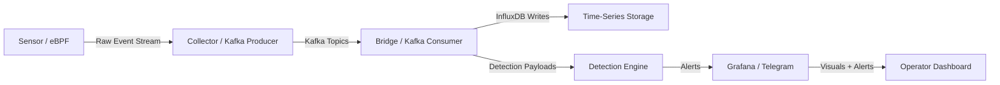
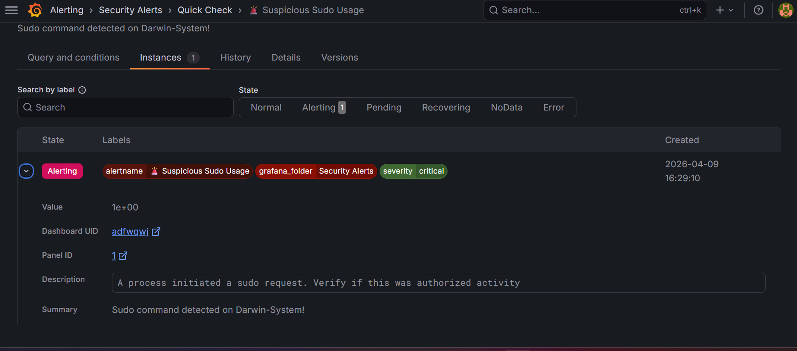

<div align="center">


<br/>

<h1>🛡️ DARWIN</h1>
<p><strong>Kernel-Aware Security Telemetry for Real-Time Threat Detection</strong></p>

<div>
  
  
  
  
  
</div>

<br />
</div>

---

## 🌌 Overview

**DARWIN** is a production-inspired security telemetry platform that elevates kernel-level process monitoring into a modern detection pipeline.

Built for security engineers, SOC teams, and research labs, DARWIN captures process execution with **eBPF**, streams events through **Kafka**, writes structured telemetry to **InfluxDB**, and exposes critical detections through **Grafana**.

This project is designed as a high-fidelity visibility engine for real-time privilege escalation and suspicious process behavior detection.

---

## 🏗️ Core Architecture

DARWIN separates sensor capture, event transport, data export, and analytics into distinct runtime components.



---

## ⚡ Technical Flagships

| Subsystem | What it protects | Implementation focus |
| :--- | :--- | :--- |
| **Kernel Visibility** | Process execution trace fidelity | `src/sensor/darwin_sensor.bpf.c` + eBPF probes |
| **Stream Resilience** | High-throughput telemetry delivery | Kafka producer/consumer pipeline |
| **Time-Series Export** | Fast query-ready observability | `src/bridge/influx_exporter.py` |
| **Threat Detection** | Suspicious `sudo` / escalation behavior | `src/detection/` analytics and malice scoring |
| **Alerting** | Incident-ready monitoring | Grafana rules + Telegram notifications |

---

## 📌 What DARWIN Detects

- Suspicious privilege escalation via `sudo`
- Anomalous process execution spikes
- High-risk command activity across container and host processes
- Kernel-level execution context with minimal noise

---

## 🚀 Quick Start

> See **[INSTALL.md](./INSTALL.md)** for complete environment setup and prerequisites.

```bash
git clone https://github.com/harshagm665-netizen/darwin-system.git
cd darwin-system
```

Start the platform:

```bash
docker compose up -d
```

Open Grafana and confirm the DARWIN dashboards are rendering data.

---

## 🔍 Example Alert

A suspicious `sudo` invocation was detected and recorded for review.

- **Alert:** Suspicious Sudo Usage
- **Severity:** critical
- **Created:** 2026-04-09 16:29:10
- **Summary:** Sudo command detected on Darwin-System!

Full alert record:
- [SECURITY_ALERT_SUSPICIOUS_SUDO_USAGE.md](./SECURITY_ALERT_SUSPICIOUS_SUDO_USAGE.md)

---

## 🎛️ Visual Output




---

## 📂 Project Structure

```
darwin-system/
├── src/
│   ├── bridge/            # Kafka -> InfluxDB export layer
│   ├── collector/         # BPF loader and Kafka producer
│   ├── dashboard/         # Grafana support utilities and web app
│   ├── detection/         # Risk scoring and behavioral analysis
│   ├── red_agent/         # alerting and response agent
│   ├── sensor/            # eBPF source and C runtime
├── deploy/                # Docker and Prometheus deployment
├── logs/                  # Runtime logs and diagnostics
├── README.md
├── INSTALL.md
├── STARTUP.md
├── docker-compose.yml
└── requirements.txt
```

---

## 🧠 Recommended Workflow

- **Extend sensor coverage** in `src/sensor/`
- **Tune Kafka topics and serialization** in `src/collector/`
- **Map events for observability** in `src/bridge/`
- **Refine detection logic** in `src/detection/`
- **Validate alert flow** through Grafana and Telegram

---

## 📌 Notes

DARWIN is intentionally a visibility and detection engine; it is not an enforcement or blocking framework. This makes it ideal for security research, incident detection, and telemetry architecture validation.

---

## 📄 License

MIT License. See `LICENSE` for details.
